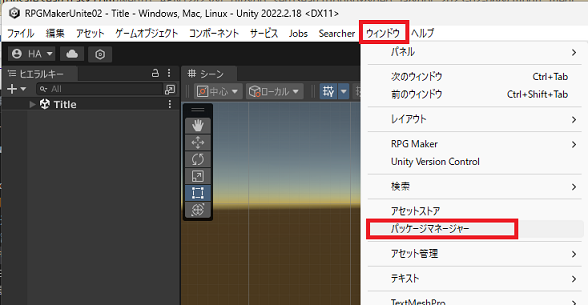
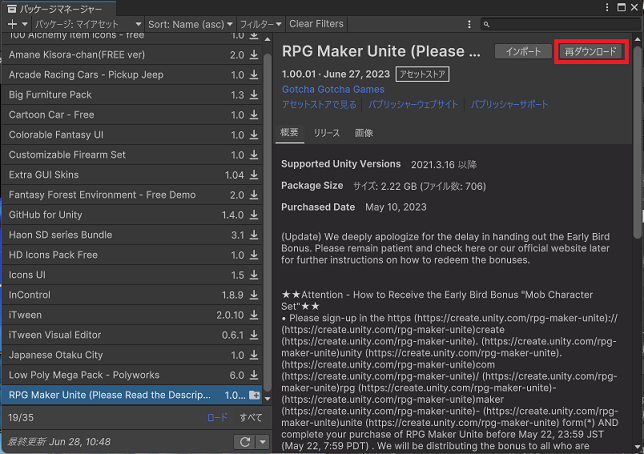

# RPG Maker Unite のアップデートの仕方

0\. これまでに変更している部分があったらバックアップを取っておく 

1\. Unity のモードを [Unity Editor] モードに変更する。（RPG Maker + Unity Editor モードになっている方はそのままでも大丈夫です。） 
     

2\. パッケージマネージャーを開く 
     

3\. パッケージマネージャーの調べたいパッケージの種類を変える。上の方の[パッケージ：プロジェクト内]のプルダウンメニューを開いて[マイアセット]を選択する。 
     
    3\.1\. パッケージマネージャーに RPG Maker Unite(以下RMU) があるか確認する。 
      

    3\.2\. パッケージマネージャーに RMU が無かった場合には下の方にある[ロード]の文字をクリックする 
          
3\. パッケージマネージャーに RMU が現れるので、右上の [更新] を選択する。([再ダウンロード]とあるが、これは既に更新してしまったため) 
    
  
4\. インポートを選び、ガイドに従って更新する。 
     
    4\.1\. 不安だったら[すべて]を選択し、インポートする。  
     
    4\.2\. 更新の確認が出てくる。この段階で、変更している部分をバックアップしていなかったらバックアップを取る。 
     
    訳は以下(Deeple 翻訳)[このプロジェクトのソースファイルの中には、変更されたAPIを参照しているものがあります。これらを自動的に更新することができます。更新する前に、プロジェクトのバックアップを取ることをお勧めします。 
はい、これらのファイルと、後で見つかるかもしれない他のファイルについてです。] 
    自信がないなら一番左のボタンを押す。

以上です。